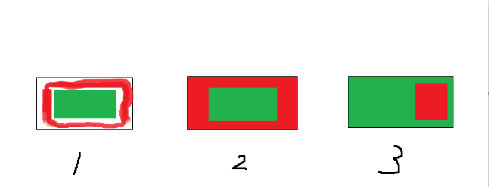
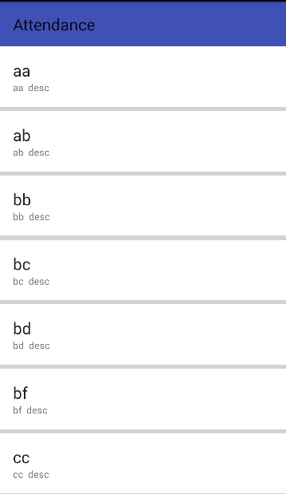
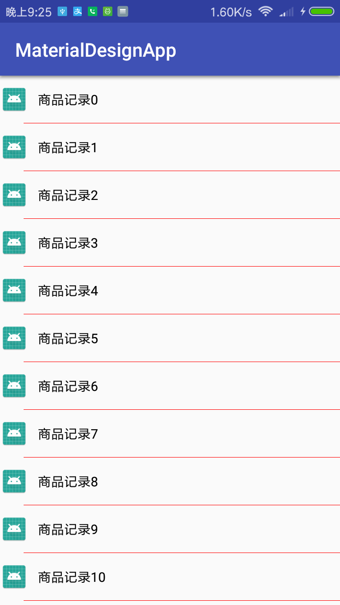

转自： [鸿洋大神](http://blog.csdn.net/lmj623565791/article/details/45059587)
### 概述
有了ListView、GridView为什么还需要RecyclerView这样的控件呢？整体上看RecyclerView提供了一种插拔式的体验，高度的解耦，异常的灵活，通过设置它提供的不同`LayoutManager`，`ItemDecoration` , `ItemAnimator`实现令人瞠目的效果。
* 你想要控制其显示的方式，请通过布局管理器`LayoutManager`
* 你想要控制Item间的间隔（可绘制），请通过`ItemDecoration`
* 你想要控制Item增删的动画，请通过`ItemAnimator`
* 你想要控制点击、长按事件，请自己写.....
###基本使用
```java
        recyclerView= findViewById(R.id.recyclerview);
        //设置布局管理器
        recyclerView.setLayoutManager(new LinearLayoutManager(this));
        //添加分割线
        recyclerView.addItemDecoration(new DividerItemDecoration(this,VERTICAL ));
        //设置Item增加、移除动画
        recyclerView.setItemAnimator(new DefaultItemAnimator());
        //设置adapter
        recyclerView.setAdapter(new MyAdapter(this));
```
```java
public class MyAdapter extends RecyclerView.Adapter <MyAdapter.MyHolder>{
    Context context;
    private final List<String> list;
    public MyAdapter(Context context){
        this.context=context;
        list =  new ArrayList<String>();
        for (int i = 0; i < 30; i++)
            list.add("商品记录" + i);
    }
    @NonNull
    @Override
    public MyHolder onCreateViewHolder(@NonNull ViewGroup parent, int viewType) {
        View view = LayoutInflater.from(context).inflate(R.layout.main_recyclerview_item, parent, false);
        MyHolder holder = new MyHolder(view);
        return holder;
    }

    @Override
    public void onBindViewHolder(@NonNull MyHolder holder, int position) {
        String item = list.get(position);
        holder.textView.setText(item);
    }

    @Override
    public int getItemCount() {
        return list.size();
    }

    public class MyHolder extends RecyclerView.ViewHolder {
        public ImageView icon;
        public TextView textView;
        //实现的方法
        public MyHolder(View itemView) {
            super(itemView);

            textView= (TextView) itemView.findViewById(R.id.textview);
        }
    }
}

```
从它类名上看，`RecyclerView`代表的意义是，我只管`Recycler View`，也就是说`RecyclerView`只管回收与复用`View`，其他的你可以自己去设置。可以看出其高度的解耦，给予你充分的定制自由（所以你才可以轻松的通过这个控件实现`ListView`,`GirdView`，瀑布流等效果）。

`RecyclerView`并没有支持分割线`divider`这样的属性。我们可以自己去定制它.
### ItemDecoration
该类为抽象类，官方目前并没有提供默认的实现类,需要我们自己去定制重写，一开始可能有人会觉得麻烦不好用，最后你会发现这种可插拔设计不仅好用，而且功能强大。
ItemDecoration类主要是三个方法：
```java
public void onDraw(Canvas c, RecyclerView parent, State state)
public void onDrawOver(Canvas c, RecyclerView parent, State state)
public void getItemOffsets(Rect outRect, View view, RecyclerView parent, State state)
```
当我们调用`recyclerView.addItemDecoration()`方法添加`decoration`的时候，`RecyclerView`在绘制的时候，去绘制`decorator`，即调用该类的`onDraw`和`onDrawOver`方法.
* `onDraw()`的绘制会先于`ItemView`的绘制,所以如果你在`onDraw()`方法中绘制的东西在`ItemView`边界内，就会被`ItemView`盖住。
* `onDrawOver()`会在`ItemView`绘制之后再绘制，所以如果你在`onDrawOver()`方法中绘制的东西在`ItemView`边界内，就会盖住ItemView。简单点说，就是先执行`ItemDecoration的onDraw()`、再执行`ItemView的onDraw()`、再执行`ItemDecoration`的`onDrawOver()`。由于和`RecyclerView`使用的是同一个`Canvas`，所以你想在`Canvas`上画什么都可以，就像我们平时自定义`View`时写`onDraw()`方法一样。

官方源码虽然都写的很清楚，但还不少小伙伴不知道怎么理解，怎么用或用哪个方法，下面画个简单的图来理解一下。



首先我们假设绿色区域代表的是我们的内容，红色区域代表我们自己绘制的装饰，可以看到：
图1：代表了`getItemOffsets()`,可以实现类似padding的效果
图2：代表了`onDraw()`,可以实现类似绘制背景的效果，内容在上面
图3：代表了`onDrawOver()`，可以绘制在内容的上面，覆盖内容

ok 接下来，让我们来实现实际开发中常遇到的场景。
#### padding
从前面的图可以看到实现这个效果，需要重写`getItemOffsets`方法。
```java
public class SimplePaddingDecoration extends RecyclerView.ItemDecoration {

    private int dividerHeight;


    public SimplePaddingDecoration(Context context) {
        dividerHeight = context.getResources().getDimensionPixelSize(R.dimen.divider_height);
    }

    @Override
    public void getItemOffsets(Rect outRect, View view, RecyclerView parent, RecyclerView.State state) {
        super.getItemOffsets(outRect, view, parent, state);
        outRect.bottom = dividerHeight;//类似加了一个bottom padding
    }
}
```
没错，就这么2行代码，然后添加到`RecyclerView`
```java
recyclerView.addItemDecoration(new SimplePaddingDecoration(this));
```
实现效果：



分割线在app中是经常用到的，用`ItemDecoration`怎么实现呢，其实上面`padding`改成`1dp`就实现了分割线的效果，但是分割线的颜色只能是设置的`RecyclerView`背景色灰色，所以不能用这种方法。
* 要实现分割线效果需要 `getItemOffsets()`和 `onDraw()`2个方法，首先用 `getItemOffsets`给item下方空出一定高度的空间），然后用`onDraw`绘制这个空间.
```java
public class DividerItemDecoration extends RecyclerView.ItemDecoration {
    private int divider=1;
    private Paint mPaint;
    public DividerItemDecoration(Context context,int orientation){
        mPaint = new Paint();
        mPaint.setAntiAlias(true);
        mPaint.setColor(Color.RED);
    }


    @Override
    public void onDraw(Canvas c, RecyclerView parent, RecyclerView.State state) {
           drawVertical(c,parent);
    }

    private void drawVertical(Canvas c, RecyclerView parent) {
        int left=parent.getPaddingLeft()+50;
        int right=parent.getWidth()-parent.getPaddingRight();
        int childCount=parent.getChildCount();
        for(int i=0;i<childCount;i++){
            View child= parent.getChildAt(i);
            RecyclerView.LayoutParams params= (RecyclerView.LayoutParams) child.getLayoutParams();
            int top=child.getBottom()+params.bottomMargin;
            int bottom=top+divider;
            c.drawRect(left,top,right,bottom,mPaint);
        }
    }

    @Override
    public void getItemOffsets(Rect outRect,
                               View view,
                               RecyclerView parent,
                               RecyclerView.State state) {

            outRect.bottom=divider; 
    }
}
```
实现效果：

